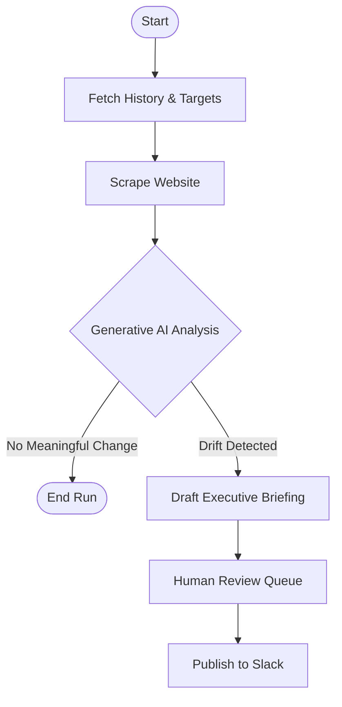
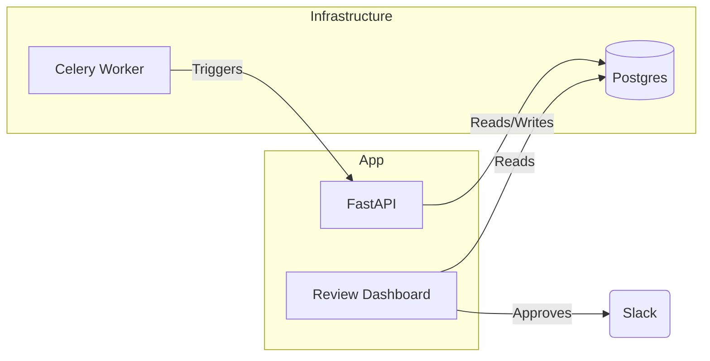

# RivalOps: Competitive Intelligence at Scale

**RivalOps** is an AI-Agent framework that autonomously monitors competitor websites, detects strategic shifts (e.g., pricing changes, new features, annoucements, etc), and generates executive briefings for stakeholders.

It moves beyond simple "pixel diffs" by using **LLM Semantic Analysis** to understand *what* changed and *why it matters*.

---

## Architecture

### Core Workflow (LangGraph)

The heart of RivalOps is a stateful workflow built with [LangGraph](https://github.com/langchain-ai/langgraph).



### System Components



---

## Challenges & Solutions

Building an autonomous intelligence agent involves overcoming noise and ensuring trust.

| Challenge | Solution |
| :--- | :--- |
| **False Positives**<br>Simulating human judgement on what counts as a "change". | **Semantic Analysis Layer**<br>Instead of flagging every CSS change, we use a two-step LLM process to discard noise (e.g., timestamps updating) and focus on semantic drifts (pricing, messaging). |
| **Cost vs. Accuracy**<br>Running GPT-4 on every check is expensive. | **Model Routing**<br>We use a "Fast Model" (e.g., GPT-4o-mini) for initial drift detection. Only when the confidence score is in the "gray zone" (0.45 - 0.65) do we escalate to a "Smart Model" (GPT-4) for verification. |
| **Trust & Safety**<br>AI hallucinations could send incorrect alerts to executives. | **Human-in-the-Loop Gate**<br>Before any briefing is sent to Slack, it enters a `PENDING` state in the Review Dashboard. A human analyst must approve or edit the briefing, ensuring 100% accuracy for high-stakes updates. |

---

## Interface Preview

<div align="center">
  
  
  
</div>

---

## Quick Start

### 1. Prerequisites
- Python 3.10+
- OpenAI API Key
- Slack Webhook URL
- Firecrawl API Key

### 2. Installation
```bash
git clone https://github.com/gauravkumarML/RivalOPS.git
cd RivalOPS
pip install -r requirements.txt
```

### 3. Running the Simulation
Ran the testing, by creating a portable simulation script that uses a local SQLite database.

```bash
# Set up simple env vars
export OPENAI_API_KEY="sk-..."

# Run the drift simulation
python3 tests/simulate_drift.py
```

**What happens?**
1.  The script simulates a "Version A" (Baseline) of a pricing page.
2.  It then simulates a "Version B" (Price Increase).
3.  The Agent detects the change, analyzes it, and generates a briefing.
4.  You will see the **Executive Briefing** printed in the terminal.


