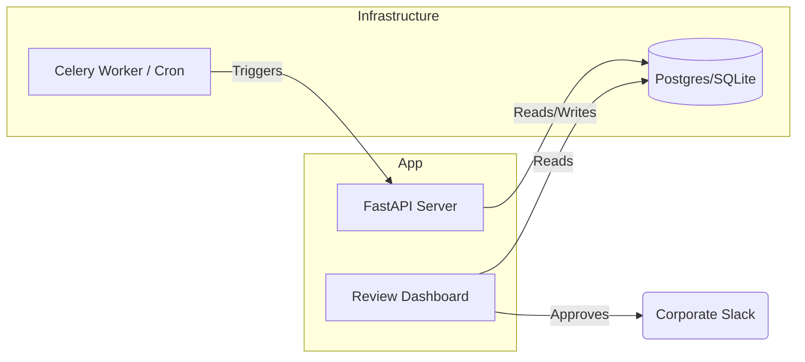

# RivalOPS: Competitive Intelligence at Scale

**RivalOPS** is an AI-powered competitive intelligence platform that autonomously monitors competitor websites, detects strategic shifts (e.g., pricing changes, new features), and generates executive briefings for stakeholders.

It moves beyond simple "pixel diffs" by using **LLM Semantic Analysis** to understand *what* changed and *why it matters*.

---

## Architecture

### Core Workflow (LangGraph)

The heart of RivalOPS is a stateful workflow built with [LangGraph](https://github.com/langchain-ai/langgraph).

```mermaid
graph TD
    Start([Start]) --> Fetch[Fetch History & Targets]
    Fetch --> Scrape[Scrape Website (Firecrawl)]
    Scrape --> Analyze{Generative AI Analysis}
    
    Analyze -- "No Meaningful Change" --> End([End Run])
    Analyze -- "Drift Detected" --> Draft[Draft Executive Briefing]
    
    Draft --> HumanGate[Human Review Queue]
    HumanGate --> Slack[Publish to Slack]
```

### System Components



---

## Challenges & Solutions

Building an autonomous intelligence agent involves overcoming noise and ensuring trust.

| Challenge | Solution |
| :--- | :--- |
| **False Positives**<br>Simulating human judgement on what counts as a "change". | **Semantic Analysis Layer**<br>Instead of flagging every CSS change, we use a two-step LLM process to discard noise (e.g., timestamps updating) and focus on semantic drifts (pricing, messaging). |
| **Cost vs. Accuracy**<br>Running GPT-4 on every check is expensive. | **Tiered Model Strategy**<br>We use a "Fast Model" (e.g., GPT-3.5/4o-mini) for initial drift detection. Only when the confidence score is in the "gray zone" (0.45 - 0.65) do we escalate to a "Smart Model" (GPT-4) for verification. |
| **Trust & Safety**<br>AI hallucinations could send incorrect alerts to executives. | **Human-in-the-Loop Gate**<br>Before any briefing is sent to Slack, it enters a `PENDING` state in the Review Dashboard. A human analyst must approve or edit the briefing, ensuring 100% accuracy for high-stakes updates. |

---

## Quick Start

### 1. Prerequisites
- Python 3.10+
- OpenAI API Key
- Slack Webhook URL (optional for simulation)

### 2. Installation
```bash
git clone https://github.com/gauravkumarML/RivalOPS.git
cd RivalOPS
pip install -r requirements.txt
```

### 3. Running the Simulation
We have improved the testing experience by creating a portable simulation script that uses a local SQLite database (no Docker required).

```bash
# Set up simple env vars (or use .env file)
export OPENAI_API_KEY="sk-..."

# Run the drift simulation (Simulates a Competitor Pricing Change)
python3 tests/simulate_drift.py
```

**What happens?**
1.  The script simulates a "Version A" (Baseline) of a pricing page.
2.  It then simulates a "Version B" (Price Increase).
3.  The Agent detects the change, analyzes it, and generates a briefing.
4.  You will see the **Executive Briefing** printed in the terminal.

### 4. Running the Dashboard
To approve the briefing and send it to Slack:

```bash
uvicorn apps.api.main:app --reload
```
Visit [http://localhost:8000/review/queue](http://localhost:8000/review/queue) to see the generated briefing.
